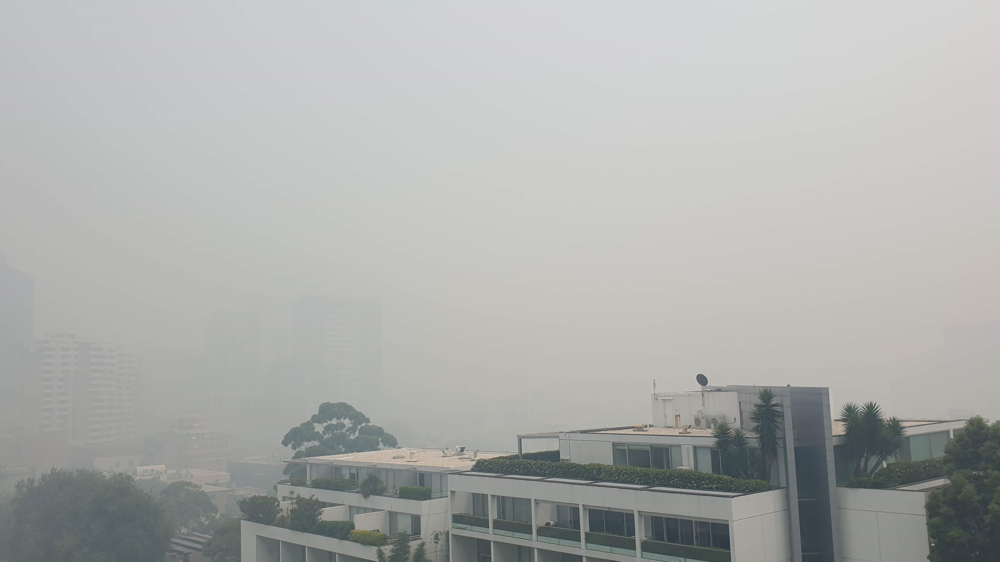

# Monitor Air Pollution with a Raspberry Pi, a Particulate Matter sensor and IoT Central

## Background

Born of necessity, this project tracks the air quality over Sydney during the height of the Australian bush fires. I wanted to gauge when it was safe to go outside, or when it was better to close up the apartment and stay in for the day.

| Sydney, Dec 2019 | Particulate matter readings|
| ---- | ---|
|  | Readings for PM 2.5 and PM 10 approx 1000. Healthy levels should be between 0 ~ 10.  |

This is Sydney on a clear day, the photo was taken in May 2020, alas, during the COVID-19 pandemic lock down. On the upside, there is close to zero air pollution.

---

## #JulyOT

This is part of the #JulyOT [IoT Tech Community](http://aka.ms/julyot) series, a collection of blog posts, hands-on-labs, and videos designed to demonstrate and teach developers how to build projects with Azure Internet of Things (IoT) services. Please also follow [#JulyOT](https://twitter.com/hashtag/JulyOT) on Twitter.

---

## Introduction

In this hands-on lab, you will learn how to create and debug a Python application on a Raspberry Pi with [Visual Studio Code](https://code.visualstudio.com/?WT.mc_id=julyot-aqm-dglover) and the [Remote SSH](https://marketplace.visualstudio.com/items?itemName=ms-vscode-remote.remote-ssh&WT.mc_id=julyot-aqm-dglover) extension. The app requires the [Pimoroni Enviro+ pHAT](https://learn.pimoroni.com/tutorial/sandyj/getting-started-with-enviro-plus), and reads data from the PMS5003 particulate matter (PM) and BME280 sensors and streams the data to [Azure IoT Central](https://azure.microsoft.com/services/iot-central/?WT.mc_id=julyot-aqm-dglover).

---

## Parts required

1. Raspberry Pi 2 or better, SD Card, and Raspberry Pi power supply
2. [Pimoroni Enviro+ pHAT](https://learn.pimoroni.com/tutorial/sandyj/getting-started-with-enviro-plus)
3. PMS5003 Particulate Matter Sensor with Cable available from [Pimoroni](https://shop.pimoroni.com/products/pms5003-particulate-matter-sensor-with-cable) and eBay.

This lab depends on Visual Studio Code and Remote SSH development. Remote SSH development is supported on Raspberry Pis built on ARMv7 chips or better. The Raspberry Pi Zero is built on ARMv6 architecture. The Raspberry Pi Zero is capable of running the solution, but it does not support Remote SSH development.

## Solution Architecture

---

## Let's get started

* Module 1: [Create an Azure IoT Central application](https://gloveboxes.github.io/Raspberry-Pi-Python-Environment-Monitor-with-the-Pimoroni-Enviro-Air-Quality-PMS5003-Sensor/zdocs/module_1_create_iot_hub/README.md)
* Module 2: [Set up your Raspberry Pi](./zdocs/module_2_set_up_raspberry_pi/README.md)
* Module 3: [Set up your development environment](https://gloveboxes.github.io/Raspberry-Pi-Python-Environment-Monitor-with-the-Pimoroni-Enviro-Air-Quality-PMS5003-Sensor/zdocs/module_3_set_up_computer/README.md)
* Module 4: [Run the solution](https://gloveboxes.github.io/Raspberry-Pi-Python-Environment-Monitor-with-the-Pimoroni-Enviro-Air-Quality-PMS5003-Sensor/zdocs/module_4_building_the_solution/README.md)
* Module 5: [Dockerize the Air Quality Monitor solution](https://gloveboxes.github.io/Raspberry-Pi-Python-Environment-Monitor-with-the-Pimoroni-Enviro-Air-Quality-PMS5003-Sensor/zdocs/module_5_docker/README.md)

## Source code

All source code available for the [Raspberry Pi Air Pollution monitor](https://gloveboxes.github.io/Raspberry-Pi-Python-Environment-Monitor-with-the-Pimoroni-Enviro-Air-Quality-PMS5003-Sensor/)

## Acknowledgements

This tutorial builds on the [Azure IoT Python SDK 2](https://github.com/Azure/azure-iot-sdk-python/tree/master/azure-iot-device/samples) samples.

---

Have fun and stay safe and be sure to follow us on [#JulyOT](https://twitter.com/hashtag/JulyOT?src=hash&ref_src=twsrc%5Etfw).