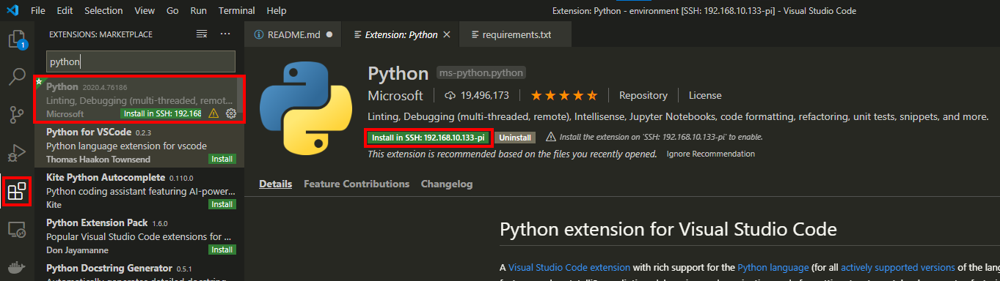

# Raspberry-Pi-Python-Environment-Monitor-with-the-Pimoroni-Enviro-Air-Quality-PMS5003-Sensor

<!-- https://docs.microsoft.com/en-us/azure/iot-central/core/tutorial-connect-device-python -->


## Azure IoT Central and Particulate Matter Monitoring  

## Software Requirements

## Install the following software components on to your Raspberry Pi

    ```bash
    sudo apt install git python3-pip
    ```

## Install the following Python Packages

    ```bash
    pip3 install ptvsd azure-iot-device psutil enviroplus RPi.GPIO pylint autopep8
    ```

## Install the following Visual Studio Code Extensions on the Raspberry Pi

    1. [Python extension for Visual Studio Code](https://marketplace.visualstudio.com/items?itemName=ms-python.python)

        * Ensure you install Python extension into SSH.

            

    2. [Docker for Visual Studio Code](https://marketplace.visualstudio.com/items?itemName=ms-azuretools.vscode-docker)


   
## Install Pimoroni Enviro+ Software

[Getting Started with Enviro+](https://learn.pimoroni.com/tutorial/sandyj/getting-started-with-enviro-plus)

### Installing the Enviro+ Python library

```bash
git clone https://github.com/pimoroni/enviroplus-python
cd enviroplus-python
sudo ./install.sh
```

## Clone the Azure IoT Environment Particle Matter Sensor


