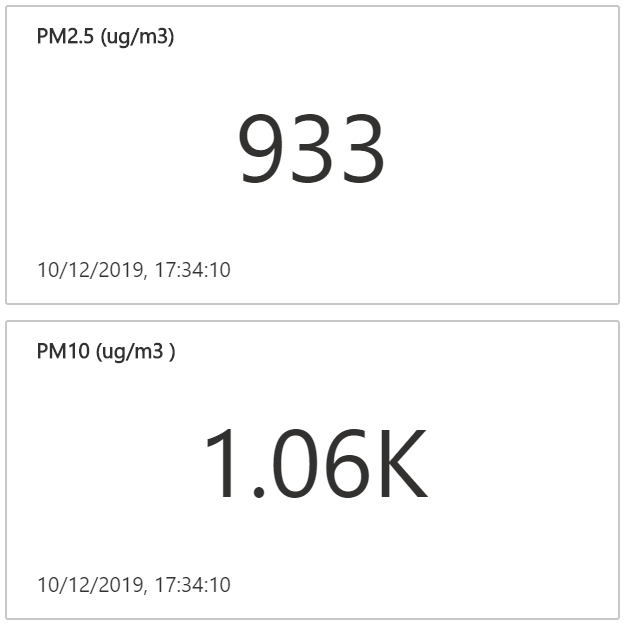

# Tutorial: Azure IoT Central and Particulate Matter Monitoring  

## Background

Born of necessity, this project tracks the air quality over Sydney during the height of the Australian bush fires. I wanted to gauge when it was safe to go outside, or when it was better to close up the apartment and stay in for the day.

| Sydney, Dec 2019 | Particulate matter readings|
| ---- | ---|
|  | Readings for PM 2.5 and PM 10 approx 1000. Healthy levels should be between 0 ~ 10.  |

This is Sydney on a clear day, the photo was taken in May 2020, alas, during the COVID-19 pandemic lock down. On the upside, there is close to zero air pollution.


---

## Introduction

In this hands-on lab, you will learn how to create and debug a Python application on a Raspberry Pi with [Visual Studio Code](https://code.visualstudio.com/?WT.mc_id=pycon-blog-dglover) and the [Remote SSH](https://marketplace.visualstudio.com/items?itemName=ms-vscode-remote.remote-ssh&WT.mc_id=pycon-blog-dglover) extension. The app requires the [Pimoroni Enviro+ pHAT](https://learn.pimoroni.com/tutorial/sandyj/getting-started-with-enviro-plus), and reads data from the PMS5003 particulate matter (PM) and BME280 sensors and streams the data to [Azure IoT Central](https://azure.microsoft.com/services/iot-central/).

---

## Terminology

1. Computer refers to your desktop or laptop computer running Linux, macOS, or Windows 10.
2. Raspberry Pi refers to your Raspberry Pi:)

---

## Parts required

1. Raspberry Pi, SD Card, and Raspberry Pi power supply
2. [Pimoroni Enviro+ pHAT](https://learn.pimoroni.com/tutorial/sandyj/getting-started-with-enviro-plus)
3. PMS5003 Particulate Matter Sensor with Cable available from [Pimoroni](https://shop.pimoroni.com/products/pms5003-particulate-matter-sensor-with-cable) and eBay.

---

## Lab set up

### Setting up a Raspberry Pi headless

Follow these steps:

1. Using the [Raspberry Pi Imager](https://www.raspberrypi.org/blog/raspberry-pi-imager-imaging-utility/) create a bootable SD Card Operating System image. From the Raspberry Pi Imager menu select Raspbian (other), then Raspbian List. Raspberry Pi Lite is headless, there is no UI, only a command line interface accessible over the network via SSH.
2. The Raspberry Pi Imager will eject the SD Card when the OS image has been copied to the SD Card. You need to physically eject the SD Card from your computer and reinsert.
3. Configure the [Raspberry Pi WiFi](https://www.raspberrypi.org/documentation/configuration/wireless/headless.md) networking]
4. Enable SSH on the SD Card. Create an empty file named **ssh** on the SD Card drive named **boot**.
5. Remove the Raspberry Pi Bootable image from your computer and insert into your Raspberry Pi
6. Attach the [Pimoroni Enviro+ pHAT](https://learn.pimoroni.com/tutorial/sandyj/getting-started-with-enviro-plus) and  PMS5003 Particulate Matter sensor.
7. Power on your Raspberry Pi
8. Wait for a minute for the Raspberry Pi to boot the first time
9. The find and make a note of the Raspberry Pi IP Address. The easiest way is from your computer, start a command prompt or terminal window. Try the following commands.

    ```bash
    ping raspberrypi.local
    ```

    If that doesn't work, try

    ```bash
    ping raspberrypi
    ```

    For other options see these [notes](https://www.raspberrypi.org/documentation/remote-access/ip-address.md).
10. Now log into your Raspberry Pi with SSH.
    1. From your computer, start a command prompt or terminal window.
    2. Run the following command

        ```bash
        ssh pi@Your Raspberry Pi IP Address
        ```

        for example

        ```bash
        ssh pi@192.168.1.25
        ```

    3. You will be prompted to trust the Raspberry Pi
    4. You will be prompted for the default Raspberry Pi password. The default password is **raspberry**.
11. Update your Raspberry Pi.
    1. From the SSH session you just started, run the following command on the Raspberry Pi. This will update the Raspberry Pi Operating System, install two required Linux packages, and reboot the Raspberry Pi

        ```bash
        sudo apt update && sudo apt install -y git python3-pip && sudo apt upgrade -y && sudo reboot
        ```

12. Wait for the Raspberry Pi to reboot. You can tell when the Raspberry Pi is ready when the green LED on the Raspberry Pi stops flickering.

### Install the following Python Packages

From the SSH session you started in the previous step install the following required Python packages. Run the following command.

```bash
pip3 install ptvsd azure-iot-device psutil enviroplus RPi.GPIO pylint autopep8
```

### Install the Pimoroni Enviro+ Python library

From the SSH session, run the following commands.

```bash
git clone https://github.com/pimoroni/enviroplus-python
cd enviroplus-python
sudo ./install.sh
```

### Clone the Azure IoT Central Python Environment Monitoring Solution

Clone the Environment Monitoring solution to your Raspberry Pi. From the SSH session, run the following command.

```bash
git clone https://github.com/gloveboxes/Raspberry-Pi-Python-Environment-Monitor-with-the-Pimoroni-Enviro-Air-Quality-PMS5003-Sensor.git environment
```


---

## Computer set up

1. Install the [git client](https://git-scm.com/downloads).
2. Clone the Environment Monitoring solution to your computer. From your computer, start a command prompt or terminal window. Change to your preferred projects directory on your computer. Make a note of the directory as you will need to refer to that directory shortly. Run:

    ```bash
    git clone https://github.com/gloveboxes/Raspberry-Pi-Python-Environment-Monitor-with-the-Pimoroni-Enviro-Air-Quality-PMS5003-Sensor.git environment
    ```


## Set up SSH Authentication between your computer and Raspberry Pi


Setting up a public/private key pair for [SSH](https://en.wikipedia.org/wiki/Secure_Shell) authentication is a secure and fast way to authenticate from your computer to the Raspberry Pi. This is recommended for this hands-on lab.

### Set up SSH for Windows Users

The SSH utility guides you through the process of setting up a secure SSH channel for Visual Studio Code and the Raspberry Pi.

You will be prompted for:

- The Raspberry Pi Network IP Address,
- The Raspberry Pi login name and password. The Raspberry Pi **default** login name is **pi**, and the default password is **raspberry**.

1. From Windows File Explorer, open the directory you cloned the Environment Monitor solution into.
2. Open the **environment** directory
3. Open the **scripts** folder
4. Double click the **windows-setup-ssh.cmd**

### Set up SSH for Linux and macOS Users

The SSH utility guides you through the process of setting up a secure SSH channel for Visual Studio Code and the Raspberry Pi.

You will be prompted for:

- The Raspberry Pi Network IP Address,
- The Raspberry Pi login name and password

1. Open a Terminal window
2. Copy and paste the following command, and press **ENTER**

    ```bash
    curl https://raw.githubusercontent.com/gloveboxes/Raspberry-Pi-Python-Environment-Monitor-with-the-Pimoroni-Enviro-Air-Quality-PMS5003-Sensor/master/scripts/ssh-setup.sh | bash
    ```

---

## Set up Visual Studio Code on your computer

This hands-on lab requires Visual Studio Code. Visual Studio Code is a code editor and is one of the most popular **Open Source** projects on [GitHub](https://github.com/microsoft/vscode). It runs on Linux, macOS, and Windows.

1. Install Visual Studio Code from [here](https://code.visualstudio.com/). 

---

## Start a Remote SSH Connection

1. Start Visual Studio Code
2. Press **F1** to open the Command Palette, type **ssh connect** and select **Remote-SSH: Connect to Host**

3. Select the **pylab-pi** configuration
    <br/>

    

    <br/>
4. Check the Remote SSH has connected.

    It will take a moment to connect, then the SSH Status in the bottom lefthand corner of Visual Studio Code will change to **>< SSH:pylab-pi**.
    <br/>

    


2. Click on the links to install the following Visual Studio Code extensions
    1. [Python extension for Visual Studio Code](https://marketplace.visualstudio.com/items?itemName=ms-python.python)
    2. [Docker for Visual Studio Code](https://marketplace.visualstudio.com/items?itemName=ms-azuretools.vscode-docker)

    Ensure when you are installing the Python and Docker extensions you are installing into SSH. The following is an example of adding the Python extension into the SSH session.

    


---

## Install Pimoroni Enviro+ Software on the Raspberry Pi

[Getting Started with Enviro+](https://learn.pimoroni.com/tutorial/sandyj/getting-started-with-enviro-plus)


## Configure Azure IoT Central

Import capability model


## Configure Python App for IoT Central

```text
SCOPE_ID={IoT Central ID Scope}
DEVICE_ID={your device id}
DEVICE_KEY={your device key}
````

## References

[Tutorial: Create and connect a client application to your Azure IoT Central application (Python)](https://docs.microsoft.com/en-us/azure/iot-central/core/tutorial-connect-device-python)