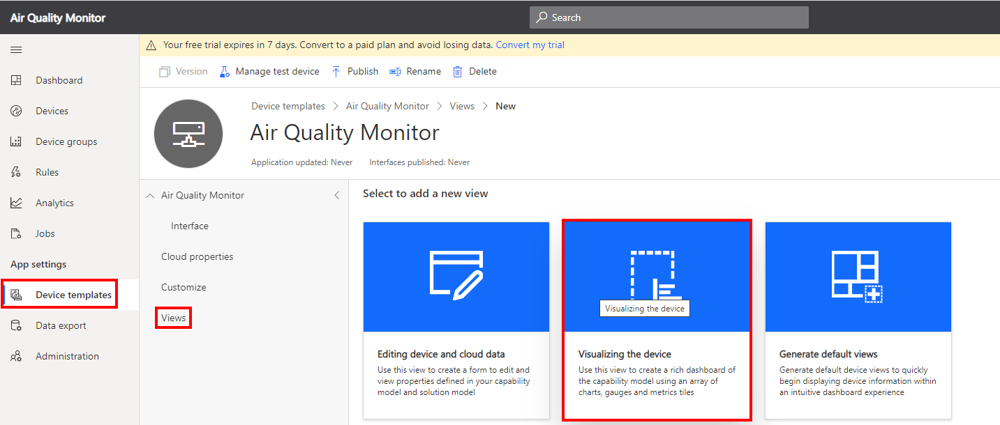
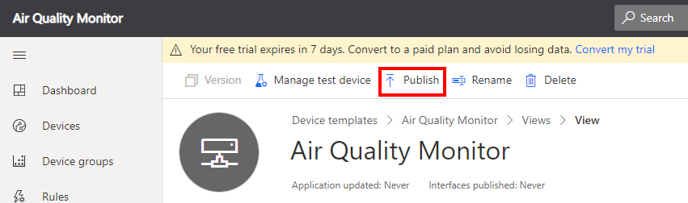
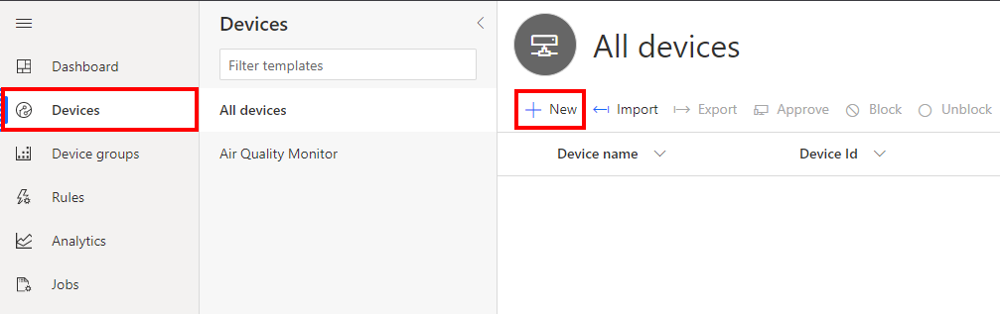
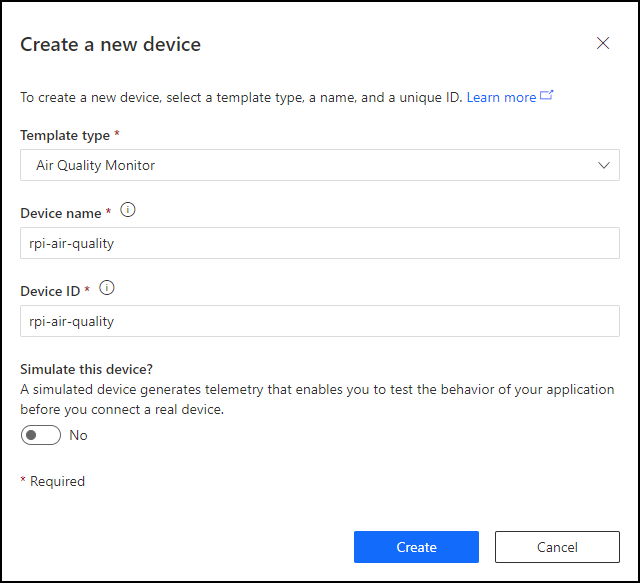
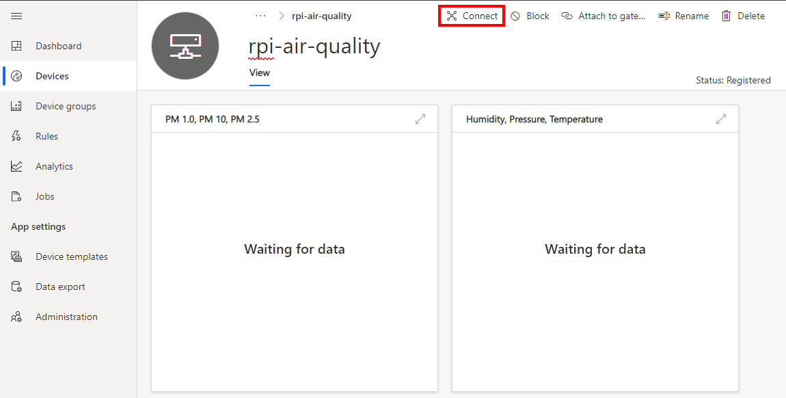
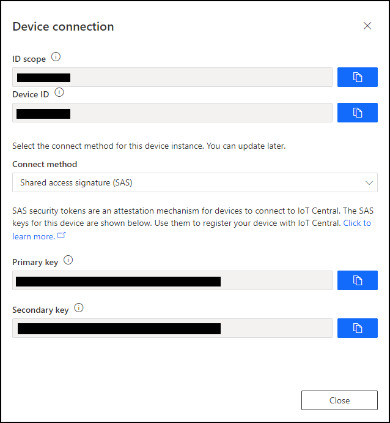

# Module 1: Create an Azure IoT Hub

---

## Index

* Module 1: [Create an Azure IoT Central application](../module_1_create_iot_hub/README.md)
* Module 2: [Set up your Raspberry Pi](../module_2_set_up_raspberry_pi/README.md)
* Module 3: [Set up your development environment](../module_3_set_up_computer/README.md)
* Module 4: [Run the solution](../module_4_building_the_solution/README.md)
* Module 5: [Dockerize the Air Quality Monitor solution](../module_5_docker/README.md)
* [Home](../../README.md)

---

## Introduction to Azure IoT Central

[Azure IoT Central](https://azure.microsoft.com/en-in/services/iot-central/?WT.mc_id=julyot-aqm-dglover) provides an easy way to connect, monitor, and manage your Internet of Things (IoT) assets at scale.

This lab will be using Azure IoT Central to graph air quality levels and set alerts. We are going to create an Azure IoT Central application and then one device.


---

## Download the Azure IoT Central capabilities file

Before you get started creating the Azure IoT Central app you need to download the device capabilities file. The device capabilities file describes the shape of the telemetry the air quality monitor application will be sending to IoT Central.

1. Start a new terminal. Windows users must start Powershell.
2. Make a note of the directory, or change to your preferred download directory you are in as you will need to navigate to this directory shortly.
3. From the Terminal/Powershell, run the following command to download the device capabilities file.

    ```bash
    curl https://raw.githubusercontent.com/gloveboxes/Raspberry-Pi-Python-Environment-Monitor-with-the-Pimoroni-Enviro-Air-Quality-PMS5003-Sensor/master/iot_central/Air%20Quality%20Monitor.json -o air-quality-iot-central-device-capabilities.json
    ```

---

## Create a New IoT Central Application

1. So the lab instructions are still visible, right mouse click, and open this link "[Azure IoT Central](https://azure.microsoft.com/en-au/services/iot-central/?WT.mc_id=julyot-aqm-dglover)" in a new window.

2. Click **Build a solution**.

3. Next, you will need to sign with your Microsoft Personal, or Work, or School account. If you do not have a Microsoft account, then you can create one for free using the **Create one!** link.

    

4. Expand the sidebar menu by clicking on the **Burger menu** icon.

    
5. Click **My apps**
5. Click **+ New application** to create a new Azure IoT Central application. 

6. Select **Custom app**

    

### Create a new application

1. Specify the **Application name**, the **URL**, select the **Free** pricing plan, and complete the registration form. 

    

2. Then click **Create**.

### Create a new device template

A device template is a blueprint that defines the characteristics and behaviors of a type of device that connects to an Azure IoT Central application.

For more information on device templates, review the [Define a new IoT device type in your Azure IoT Central application](https://docs.microsoft.com/en-us/azure/iot-central/core/howto-set-up-template?WT.mc_id=julyot-aqm-dglover) article. 

1. Click **Device templates**, then **+ New**.
    

2. Click the **IoT device** template type.

    

3. Create an **IoT Device** Template.

    1. Select **IoT device**,
    2. Click **Next:Customise**,
    3. Name your template **Air Quality Monitor**,
    4. Click **Next: Review**,
    5. Click **Create**.


#### Import a Capability Model

1. Add an Interface

    1. Click **Import capability model**
    2. Navigate to the folder you cloned the solution into.
    3. Select **Air Quality Monitor.json** and open

### Import a Capability Model

1. Click **Import capability model**
2. Navigate to the folder you downloaded the device capabilities file into.
4. Select **air-quality-iot-central-device-capabilities.json** and open

### Create a device visualization view

2. Create a view
    1. Click **Views**
        
    2. Select **Visualizing the device**
    3. Select the Particular Matter telemetry
        
    4. Click **Add Tile**
    5. Select Humidity, Pressure, and Temperature telemetry.
        
    6. Click **Add Tile**
        
    7. **Save** the view
        
        <br/>

3. Click **Publish** to publish the template

    

4. Click **Publish** again to confirm you wish to publish the template for use within the IoT Central application.

---

## Create a device

1. Click **Devices** from IoT Central sidebar menu.
2. Click **+ New** to add a new device.
    
3. Complete the **Create a new device** form.
    * **Template type**: Select the device template you just created
    * **Device Name**: Name your device. For example *rpi-air-quality*.
    * **Device ID**: For simplicity, use the same name as your device name.
4. Click **Create**

    

---

## Display device connection information

1. Click on the newly created device.
2. Click **Connect** to display the connection information

    
3. Leave the **Device Connection** panel open as you will need to copy and paste this connection information into the air quality monitor application soon.
    

---

**[NEXT](../module_2_set_up_raspberry_pi/README.md)**

---
