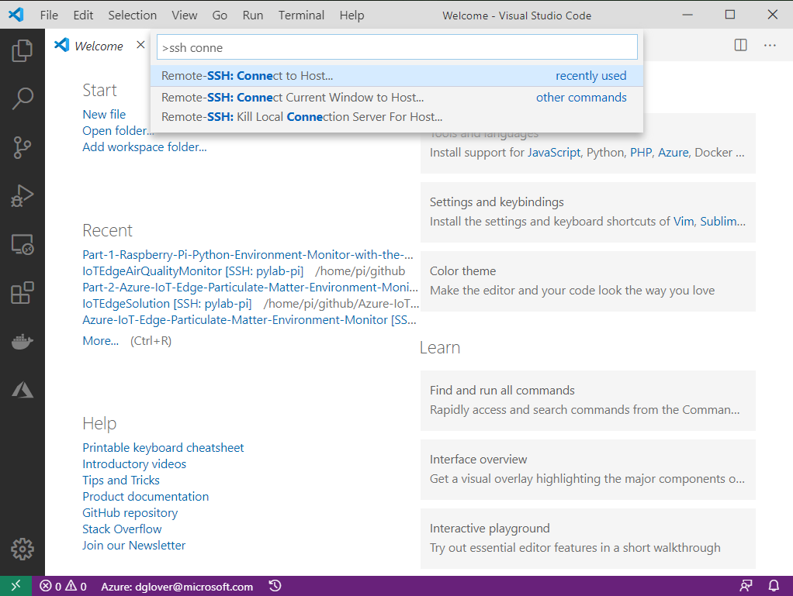
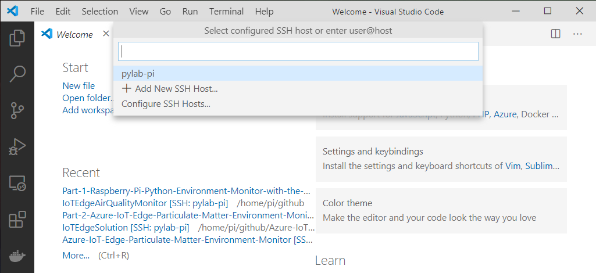
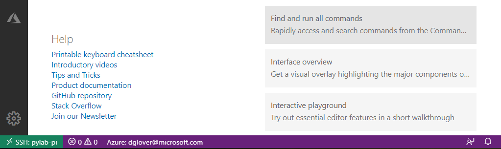

# Module 3: Set up your development environment

---

## Index

* Module 1: [Create an Azure IoT Central application](../module_1_create_iot_hub/README.md)
* Module 2: [Set up your Raspberry Pi](../module_2_set_up_raspberry_pi/README.md)
* Module 3: [Set up your development environment](../module_3_set_up_computer/README.md)
* Module 4: [Run the solution](../module_4_building_the_solution/README.md)
* Module 5: [Dockerize the Air Quality Monitor solution](../module_5_docker/README.md)
* [Home](../../README.md)

---

## Set up SSH Authentication between your computer and Raspberry Pi


Setting up a public/private key pair for [SSH](https://en.wikipedia.org/wiki/Secure_Shell) authentication is a secure and fast way to authenticate from your computer to the Raspberry Pi. Visual Studio Code Remote SSH Development will be using SSH authentication.

The Raspberry Pi SSH Authentication utility will prompt you for:

- The Raspberry Pi Network IP Address. Run ```hostname -I | cut -d" " -f 1``` on your Raspberry Pi to display its IP address.
- The Raspberry Pi login name and password. The Raspberry Pi **default** login name is **pi**, and the default password is **raspberry**.

### Set up SSH for Windows Users

The SSH utility guides you through the process of setting up a secure SSH channel for Visual Studio Code and the Raspberry Pi.

1. Start Powershell
    From the Start Menu. Click Start, type PowerShell, and then click Windows PowerShell.
2. Download the Raspberry Pi SSH Authentication Utility.

    Run the following PowerShell command.

    ```powershell
    Invoke-WebRequest -Uri "https://raw.githubusercontent.com/gloveboxes/Setting-up-Raspberry-Pi-SSH-Authentication/master/windows-ssh-setup.cmd" -OutFile "windows-ssh-setup.cmd" ; .\windows-ssh-setup.cmd
    ```

### Set up SSH for Linux and macOS Users

The SSH utility guides you through the process of setting up a secure SSH channel for Visual Studio Code and the Raspberry Pi.

1. Open a Terminal window
2. Copy and paste the following command, and press **ENTER**

    ```bash
    curl https://raw.githubusercontent.com/gloveboxes/Setting-up-Raspberry-Pi-SSH-Authentication/master/ssh-setup.sh | bash
    ```

---

## Install Visual Studio Code on your computer

Visual Studio Code is a code editor and is one of the most popular **Open Source** projects on [GitHub](https://github.com/microsoft/vscode). It runs on Linux, macOS, and Windows.

1. Install Visual Studio Code from [here](https://code.visualstudio.com/?WT.mc_id=julyot-aqm-dglover).

---

## Start a VS Code and start a Remote SSH Session

1. Start Visual Studio Code
2. Press **F1** to open the Command Palette, type **ssh connect** and select **Remote-SSH: Connect to Host**
    

3. Select the **pylab-pi** configuration
    <br/>

    

    <br/>
4. A new instance of VS Code starts and connected to your Raspberry Pi.

    > It will take a moment to connect, then the SSH Status in the bottom lefthand corner of Visual Studio Code will change to **>< SSH:pylab-pi**.
    <br/>

    

---

## Install VS Code Extensions

The following Visual Studio Code Extensions are required.

[Python extension for Visual Studio Code](https://marketplace.visualstudio.com/items?itemName=ms-python.python&WT.mc_id=julyot-aqm-dglover)
[Docker for Visual Studio Code](https://marketplace.visualstudio.com/items?itemName=ms-azuretools.vscode-docker&WT.mc_id=julyot-aqm-dglover)

To install the required Visual Studio Code Extensions, follow these instructions:

1. From Visual Studio Code menu, click **View**, then **Extensions**.
2. Type **Python extension for Visual Studio Code**.
3. Click **Install in SSH: pylab-pi**.
4. Repeat this process for the **Docker for Visual Studio Code**.
5. You will be prompted to Reload. Click on **Reload Required**.

---

## Open the Raspberry Pi Air Quality Monitor on the Raspberry Pi

Now that you have started the Visual Studio Code Remote SSH Development you need to open the **raspberry-pi-air-quality-monitor** you cloned to the Raspberry Pi.

1. From the Visual Studio Code menu, click **File**, then **Open Folder**.

    This will open the file system on the Raspberry Pi.

2. Select the *raspberry-pi-air-quality-monitor* directory.

    

3. Click **OK**.

---

**[NEXT](../module_4_building_the_solution/README.md)**

---
