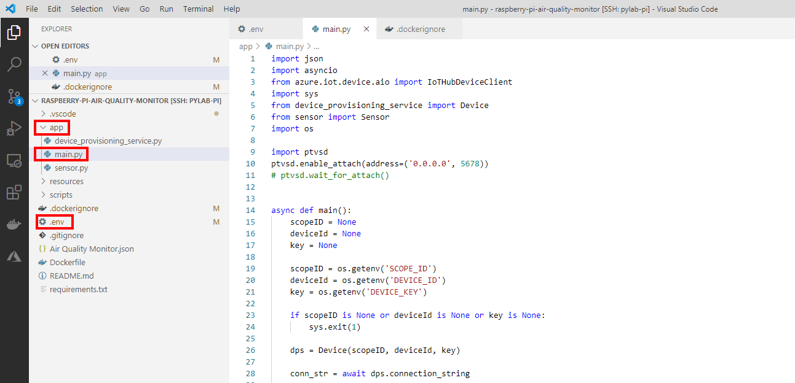
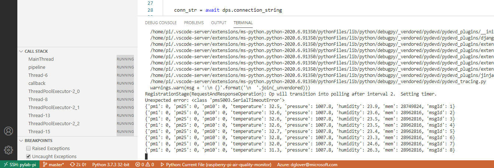
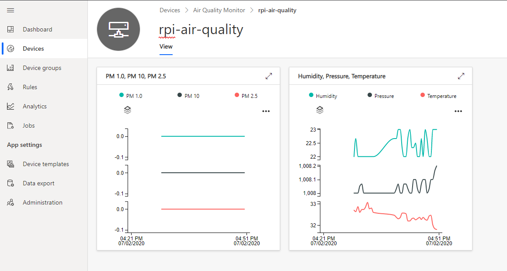

# Module 4: Build and deploy the solution

---

## Index

* Module 1: [Create an Azure IoT Central application](../module_1_create_iot_hub/README.md)
* Module 2: [Set up your Raspberry Pi](../module_2_set_up_raspberry_pi/README.md)
* Module 3: [Set up your development environment](../module_3_set_up_computer/README.md)
* Module 4: [Run the solution](../module_4_building_the_solution/README.md)
* Module 5: [Dockerize the Air Quality Monitor solution](../module_5_docker/README.md)
* [Home](../../README.md)

---

## Explore the solution

1. Expand the **app** folder.
2. Double click **main.py**, this is the main python application reads the sensor and sends the telemetry to Azure IoT Central.



---

## Configure the IoT Central device connection

1. Open the **.env** file
2. Update with the **Device Connection** information from IoT Central. Remember, this was the **Device Connection** panel.
    
2. After you have updated the the **.env** file it will look similar to the following:

    ```text
    SCOPE_ID=0ne0012C57C
    DEVICE_ID=rpi-air-quality
    DEVICE_KEY=jJitjNFnDPJpzKwDTSwur4wdJwCpnOrq8oonezQDzss=
    ```

## Start the application

1. Select the **Run** configuration. From the Visual Studio Code main menu, click **View**, then **Run**.
2. From the **Run** drop down menu, select **Python: Current File**

    

3. Press <kbd>F5</kbd> to start running and debugging the application on the Raspberry Pi.
4. Monitor the Visual Studio terminal window as the application starts. The application prints the telemetry as a JSON string in the Terminal window and then sends the telemetry to IoT Central.
    
5. View the telemetry in Azure IoT Central

    * Switch back to IoT Central in the browser, and ensure you have select your device.

        

6. Press <kbd>Shift+F5</kbd> to stop the application.

## Learning about the debugger

Check out the [Debug your Python code](https://docs.microsoft.com/en-us/visualstudio/python/debugging-python-in-visual-studio?view=vs-2019&WT.mc_id=julyot-aqm-dglover) article to learn more about debugging Python applications with Visual Studio Code.

---

**[NEXT](../module_5_docker/README.md)**

---
